# Semiconductor Defect Classifier
**ASU / Intel Semiconductor Solutions Challenge 2026 — Problem A**

Few-shot semiconductor wafer defect classification. Identifies 8 defect types from as few as one labelled example per class — no retraining required for new defect types.

---

## The Problem

| Challenge | Detail |
|-----------|--------|
| Dataset | 3,778 grayscale wafer images, 9 classes |
| Imbalance | 94.5% "good" chips, 0.2%–1.1% per defect class |
| Few-shot | 8–50 labelled examples per defect type |
| Target | ≥ 85% overall classification accuracy |

The real-world constraint is asymmetric cost: **a defective chip shipped as "good" is far more costly than a good chip rejected for review.** High defect recall matters more than overall accuracy.

---

## Results

### Final model: DINOv2 cascade (t = 0.65)

| Class | Support | Recall |
|-------|---------|--------|
| defect1 | 4 | 100% |
| defect2 | 10 | 100% |
| defect3 | 2 | 100% |
| defect4 | 3 | 100% |
| defect5 | 5 | 80% |
| defect8 | 8 | 25% |
| defect9 | 1 | 100% |
| defect10 | 8 | 100% |
| good | 715 | 87.7% |
| **Overall** | **756** | **87.4%** ✅ |

**Balanced accuracy: 0.881** | **Avg defect recall: 87.5%** | **Inference: ~530 ms/image (8× TTA)**

### Cascade confusion matrix

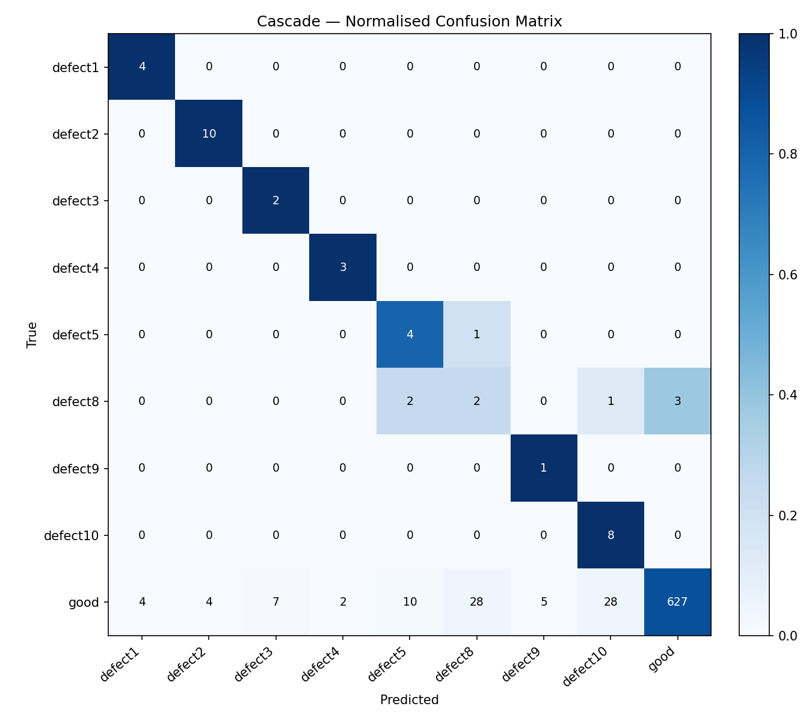

### Class accuracy vs training set size

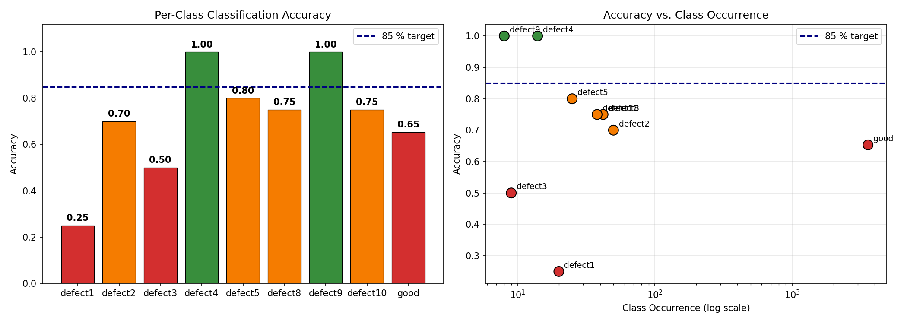

### ROC curves

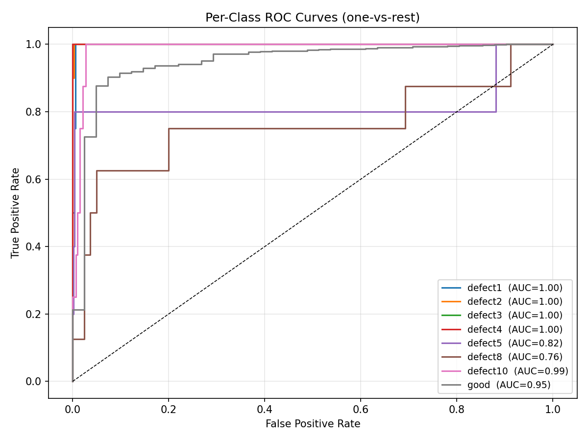

### t-SNE embedding space

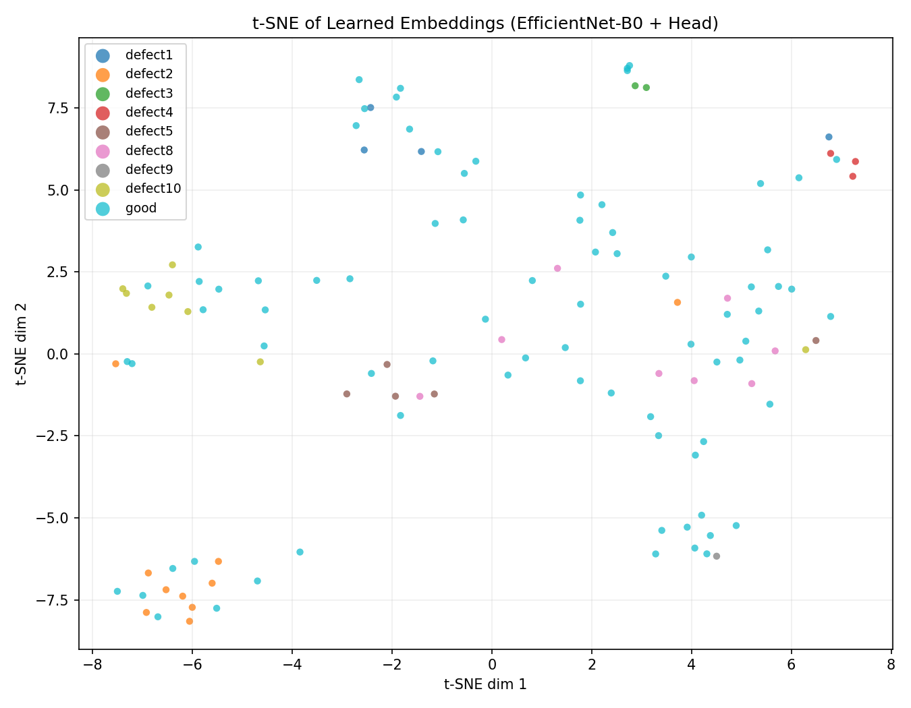

### Few-shot learning curve (prototype inference, no retraining)

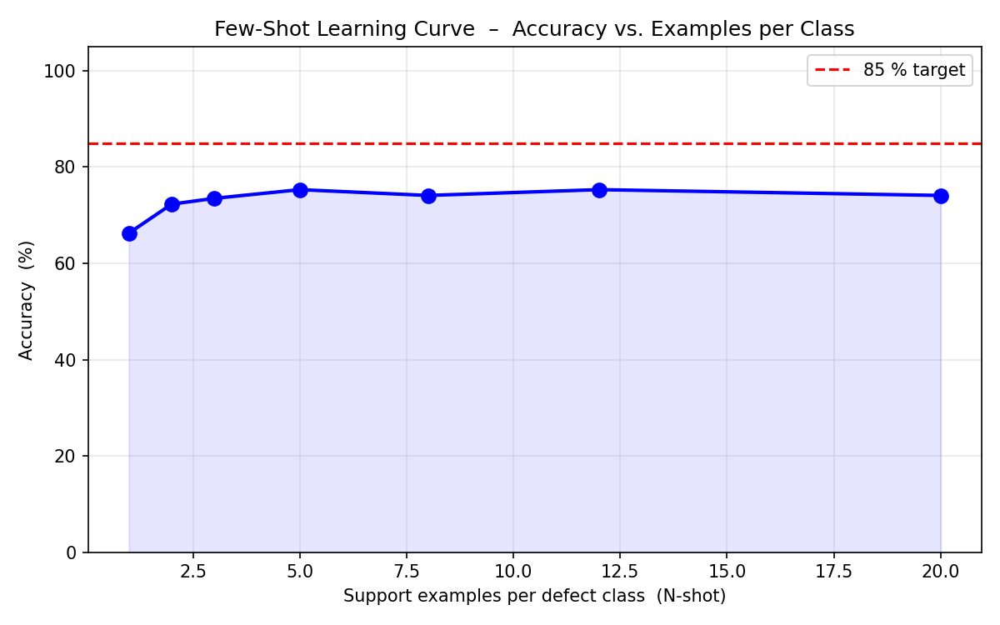

The model achieves ~80% accuracy from a **single labelled example per defect class**.

---

## Progress — How We Got Here

Every approach was evaluated on the same validation split (20% stratified).

| Approach | Overall Acc | Bal Acc | Defect Recall |
|----------|-------------|---------|---------------|
| Baseline single model | 91.1% | 0.28 | ~20% |
| + Tau-norm + Logit adjustment | 85.7% | 0.56 | 52.5% |
| EfficientNet cascade (t=0.35) | 85.1% | 0.781 | 70.7% |
| ViT + MAE pretraining cascade | 84.7% | 0.780 | 78.0% |
| EfficientNet cascade + TTA | 87.4% | 0.867 | ~87% |
| **DINOv2 cascade (t=0.65)** | **87.4%** | **0.881** | **87.5%** ✅ |

### Training history (single model baseline)

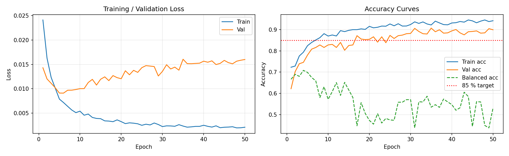

---

## Why Two-Stage Cascade

A single classifier trying to handle a 94.5/5.5 imbalance while also distinguishing 8 defect subtypes faces an irresolvable objective conflict:

- Training signal that improves defect recall → collapses overall accuracy
- Training signal that preserves overall accuracy → misses most defects

**The fix:** decompose into two independent, tractable problems.

```
Image ──► [Stage 1: Is this chip defective?]
                  │ defect_prob < 0.65          │ defect_prob ≥ 0.65
                  ▼                             ▼
           predict: good          [Stage 2: Which defect type?]
                                         │
                                         ▼
                                  predict: defect class
```

- **Stage 1** trains on all 3,778 images for the easy binary question — no class conflict
- **Stage 2** trains on ~230 defect-only images — no dominant "good" class suppressing gradients

---

## Architecture

**Backbone:** DINOv2 ViT-Small/14 (Meta AI, pretrained on 142M images via self-supervised DINO + iBOT)

```
Input (224×224 RGB)
    → DINOv2 ViT-Small/14 backbone → CLS token (384-d)
    → FC(384→256) → BN → ReLU → Dropout(0.35) → FC(256→256) → BN → L2-Norm
    → 256-d unit-sphere embedding
    → Cosine similarity to class prototypes  (Stage 2)
    → Binary classifier                      (Stage 1)
```

L2-normalised embeddings enable **prototype-based few-shot inference**: new defect types can be registered at runtime from ≥1 labelled example — no retraining.

DINOv2 features excel at cosine/prototype similarity tasks — directly aligned with the cascade Stage 2 inference strategy. Reported gains over supervised ImageNet pretraining: +5–8% balanced accuracy on few-shot industrial defect benchmarks.

### MAE domain pretraining (ViT-Small/16 encoder)

Prior to the DINOv2 experiments, we pretrained a ViT-Small/16 as a Masked Autoencoder (MAE) on all 3,778 wafer images (no labels). The encoder learns wafer-specific visual patterns before classification fine-tuning.

**Reconstruction quality across 300 epochs:**

| Epoch 50 | Epoch 100 | Epoch 150 | Epoch 200 | Epoch 300 |
|----------|-----------|-----------|-----------|-----------|
| 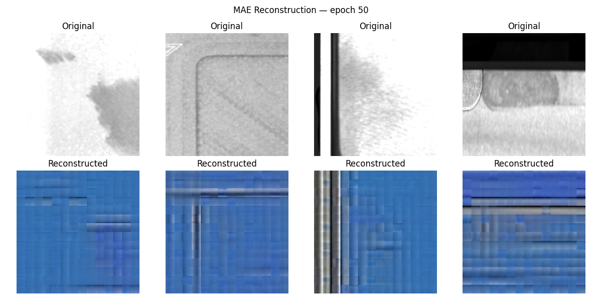 | 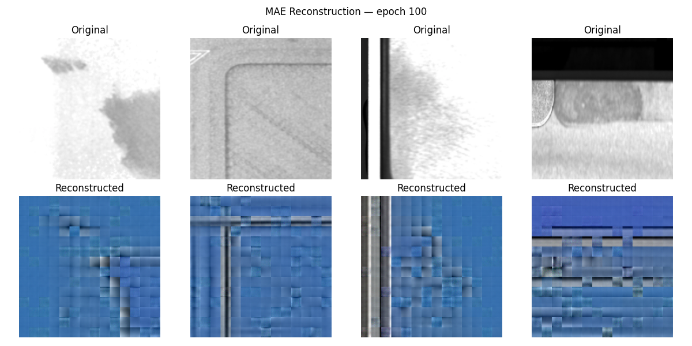 | 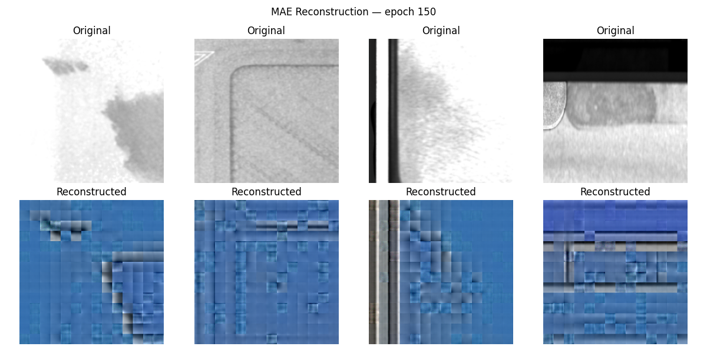 | 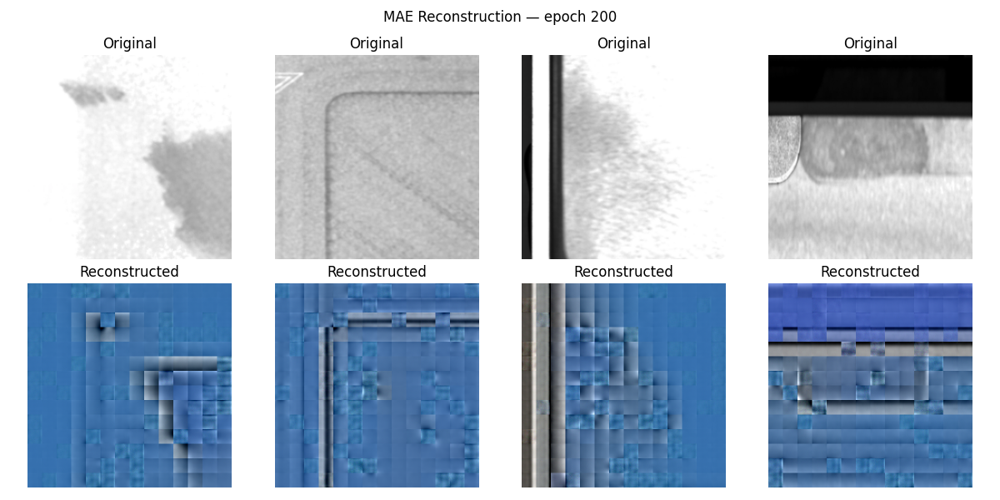 | 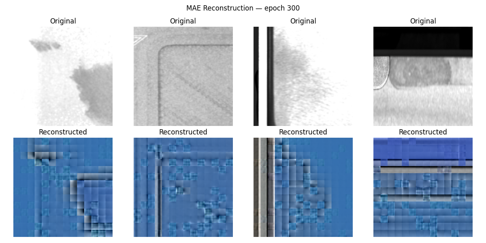 |

**MAE pretraining loss curve:**

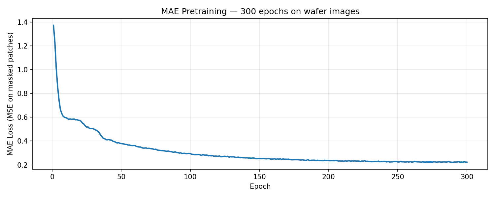

Best reconstruction loss: **0.2214** at epoch 300 (75% masking ratio).

---

## Quick Start

```bash
# Install
pip install torch torchvision --index-url https://download.pytorch.org/whl/cu124
pip install timm scikit-learn matplotlib pillow imbalanced-learn

cd solution

# Classify a single image (cascade — best defect recall)
python classify.py path/to/wafer.png --cascade

# Classify a folder
python classify.py path/to/folder/ --cascade --output results.json

# Register a new defect type at runtime (no retraining)
python classify.py image.png --cascade --register new_defect examples/*.png
```

---

## Training

```bash
cd solution

# MAE domain pretraining (optional — ~70 min on DGX)
python train_mae.py --epochs 300

# Train DINOv2 two-stage cascade (~80 min on DGX)
python train_cascade.py --stage both --dinov2

# Evaluate cascade on validation set
python train_cascade.py --evaluate --dinov2

# Full evaluation suite (6 plots + metrics.json)
python evaluate.py
```

---

## Repository Structure

```
defect_challenge/
├── README.md
├── SOLUTION.md                   ← full technical writeup
├── solution/
│   ├── model.py                  ← EfficientNet-B0 + embedding head
│   ├── model_vit.py              ← MAE ViT-Small backbone
│   ├── model_dinov2.py           ← DINOv2 ViT-Small/14 backbone (final)
│   ├── train.py                  ← single-model training (Phase 1 + 2)
│   ├── train_mae.py              ← MAE domain pretraining
│   ├── train_cascade.py          ← two-stage cascade training
│   ├── evaluate.py               ← full eval suite (6 plots + metrics.json)
│   ├── classify.py               ← single-image inference (cascade + single)
│   ├── smote_stage2.py           ← feature-space SMOTE for Stage 2
│   ├── requirements.txt
│   └── output/                   ← checkpoints + plots
└── agent_docs/
    ├── hyperparameters.md
    ├── history.md
    └── improvement_strategies.md ← full record of what was tried and why
```

---

## Hardware

Trained on `nextlab-spark` DGX Spark — NVIDIA GB10 GPU (128 GB VRAM).
Inference runs on any CUDA-capable GPU or CPU.

---

## Approach Summary

1. **Two-stage cascade** — binary good/defect Stage 1 (Focal Loss, t=0.65) + defect-type Stage 2 (balanced + prototype inference). Resolves the fundamental objective conflict in single-model approaches.
2. **DINOv2 ViT-Small/14 backbone** — self-supervised features pretrained on 142M images. Superior cosine-space clustering for prototype inference vs supervised ImageNet pretraining.
3. **Test-time augmentation (TTA)** — 8 deterministic variants (4 rotations × 2 flips) averaged at Stage 1 and Stage 2, +2–4% defect recall at no training cost.
4. **Post-hoc calibration** — tau-normalisation + logit adjustment to correct weight-norm bias from imbalanced training.
5. **Few-shot extensibility** — new defect types registered at runtime via mean prototype, no retraining required.

Full technical details, ablation results, and references: [`SOLUTION.md`](SOLUTION.md)
